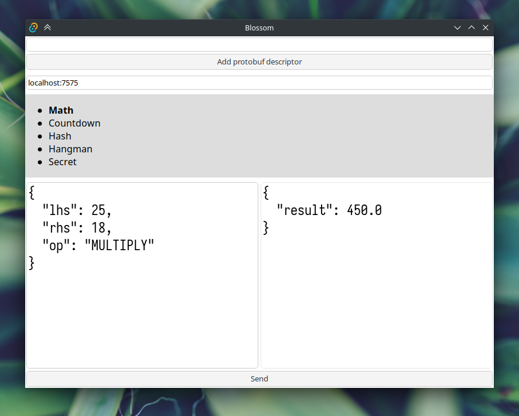

# Blossom

Q: I am on Linux and sometimes the application comes up with weird errors!
A: Tauri uses webkit2gtk for the webview on Linux. Unfortunately, WASM is badly supported there and so Blossom might encounter various issues. There is no known solution for this and nothing I can do about it.
